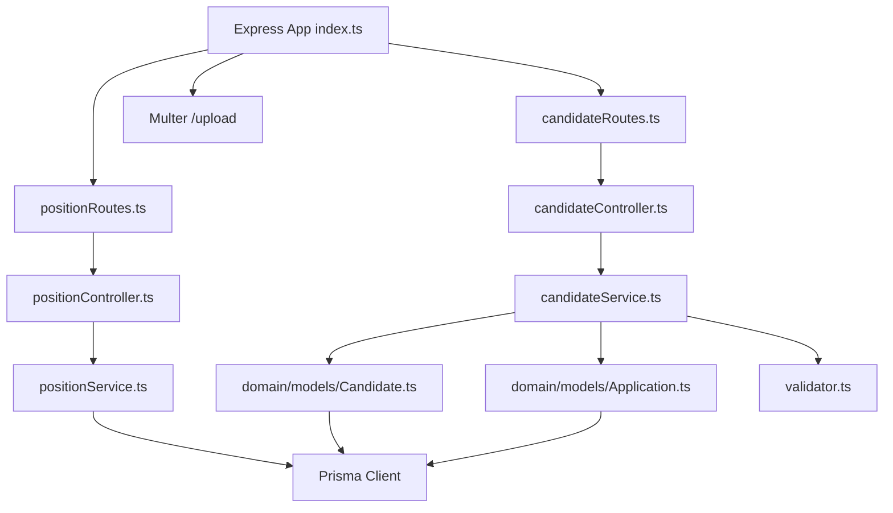

# Backend Agent Guide

## Scope
Backend-only. Analyze and modify only files under `backend/src/**` and `backend/prisma/**`. Treat the frontend as a read-only API consumer. Do not suggest frontend changes.

## Backend Structure

```text
backend/
├── prisma/
│   ├── schema.prisma          # 11 models: Candidate, Application, Position, Interview, etc.
│   ├── migrations/            # SQL migrations (PostgreSQL)
│   └── seed.ts                # Demo data: 1 company, 2 flows, 2 positions, 3 candidates, 3 applications, 3 interviews
├── src/
│   ├── index.ts               # Express app bootstrap, CORS, routes, Prisma middleware
│   ├── routes/
│   │   ├── candidateRoutes.ts # /candidates
│   │   └── positionRoutes.ts  # /positions
│   ├── presentation/
│   │   └── controllers/
│   │       ├── candidateController.ts
│   │       └── positionController.ts
│   ├── application/
│   │   ├── services/
│   │   │   ├── candidateService.ts    # addCandidate, findCandidateById, updateCandidateStage
│   │   │   ├── positionService.ts     # getAllPositions, getCandidatesByPosition, getInterviewFlowByPosition
│   │   │   └── fileUploadService.ts   # Multer upload handler
│   │   └── validator.ts             # Manual regex validation for candidate fields
│   └── domain/
│       └── models/
│           ├── Candidate.ts
│           ├── Application.ts
│           ├── Education.ts
│           ├── WorkExperience.ts
│           ├── Resume.ts
│           └── ... (Position, Interview, InterviewFlow, InterviewStep, InterviewType, Employee, Company)
├── api-spec.yaml              # OpenAPI 3.0 spec
├── package.json               # Express 4 + Prisma 5 + Jest 29 + ts-jest
├── tsconfig.json              # strict, commonjs, es5 target
└── .eslintrc.js               # prettier/recommended only
```

## Dependency Graph



## Coding Standards

**Language:** TypeScript 4.9, strict mode, CommonJS output (`"module": "commonjs"`).

**Architecture:** Express routes → controllers → application services → domain models → Prisma ORM.

**Controllers:** Async/await, try/catch per route. Return `{ message, error }` on failure. HTTP status codes: 200, 201, 400, 404, 500.

**Services:** Business logic + Prisma queries. Domain model classes wrap Prisma operations (e.g., `Candidate.save()`, `Application.save()`).

**Domain models:**
- Class-based with `save()`, `findOne()`, `findOneByPositionCandidateId()`.
- Each model instantiates its own `PrismaClient()` (not shared).
- Models handle nested create via Prisma `create` with nested `create` blocks.

**Validation:**
- `validator.ts`: manual regex-based validation (name, email, phone, date, address, education, experience, CV).
- No schema validation library (no Zod, Joi, Yup).

**Error handling:**
- Controllers catch `Error` and `unknown` errors.
- Prisma error codes checked (`P2002` unique constraint, `P2025` not found).

## API Conventions

**Base path:** `http://localhost:3010`

**REST endpoints:**
| Method | Path | Controller | Description |
|--------|------|------------|-------------|
| GET | `/positions` | getAllPositions | List visible positions |
| GET | `/positions/:id/candidates` | getCandidatesByPosition | Candidates for position with avg score |
| GET | `/positions/:id/interviewflow` | getInterviewFlowByPosition | Interview steps + position name |
| POST | `/candidates` | addCandidateController | Create candidate + educations + experiences + CV |
| GET | `/candidates/:id` | getCandidateById | Full candidate profile |
| PUT | `/candidates/:id` | updateCandidateStageController | Update `currentInterviewStep` via Application model |
| POST | `/upload` | uploadFile | Multer upload (PDF/DOCX, max 10MB) |

**Request/response:** JSON. File upload: `multipart/form-data`.

**CORS:** Configured for `http://localhost:3000` with credentials.

**No authentication, no authorization.**

## Data Layer

**ORM:** Prisma 5 with PostgreSQL.

**Schema highlights:**
- Candidate ↔ Education, WorkExperience, Resume (1:N)
- Candidate ↔ Application (1:N)
- Position ↔ Application (1:N), Position ↔ InterviewFlow (N:1)
- InterviewFlow ↔ InterviewStep (1:N)
- InterviewStep ↔ Interview (1:N), InterviewStep ↔ Application (1:N via `currentInterviewStep`)
- Interview ↔ Application, InterviewStep, Employee (N:1 each)
- Company ↔ Employee, Company ↔ Position (1:N)

**Migrations:** SQL files in `prisma/migrations/`. No migration command shortcuts in package.json (only `prisma:generate`).

**Seeding:** `prisma/seed.ts` creates demo data. Run with `npx prisma db seed` or `ts-node prisma/seed.ts`.

## Current Implementation

**Implemented:**
- Full CRUD for Candidate creation (with nested educations, experiences, resume).
- Position listing (only `isVisible: true`).
- Interview flow retrieval per position.
- Candidate listing per position with average interview score.
- Candidate stage update via Application model.
- File upload (PDF/DOCX) with multer.
- Demo seed data.

**Not implemented:**
- Interview creation endpoint (frontend UI exists but no matching route/controller).
- Auth/authorization.
- Pagination on any list endpoint.
- Global error middleware only logs and returns generic 500.

## Validation Commands

```bash
# Start dev server (with hot reload)
cd backend && npm run dev

# Build
cd backend && npm run build

# Run tests (Jest + ts-jest)
cd backend && npm test

# Prisma generate
cd backend && npx prisma generate

# Prisma migrate
cd backend && npx prisma migrate dev

# Seed database
cd backend && npx prisma db seed
```
