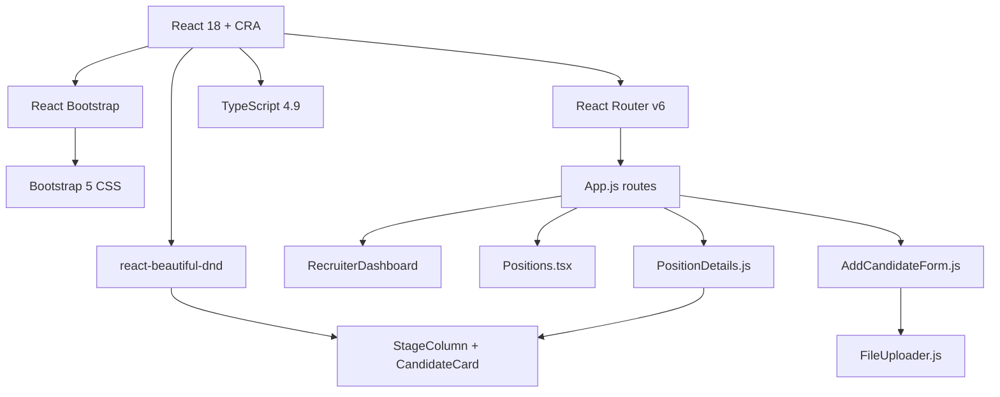

# Frontend Agent Guide

## Scope
Frontend-only. Analyze and modify only files under `frontend/src/**`. API contracts with the backend are treated as read-only facts. Do not suggest backend or schema changes.

## Frontend Structure

```text
frontend/
├── public/
├── src/
│   ├── components/
│   │   ├── AddCandidateForm.js          # Multi-section form with education + work experience
│   │   ├── CandidateCard.js             # Draggable card in kanban (name + emoji rating)
│   │   ├── CandidateDetails.js          # Offcanvas detail panel + interview notes form
│   │   ├── FileUploader.js              # File select + upload to /upload
│   │   ├── PositionDetails.js           # Kanban board: columns per interview step
│   │   ├── Positions.tsx                # Grid listing of open positions with filters
│   │   ├── RecruiterDashboard.js        # Landing page with nav cards
│   │   └── StageColumn.js               # Droppable column wrapper for kanban
│   ├── services/
│   │   └── candidateService.js          # axios helpers: uploadCV, sendCandidateData
│   ├── App.js                           # BrowserRouter with 4 routes
│   ├── index.tsx                        # CRA entry point
│   └── index.css                        # Minimal global styles
├── package.json                         # CRA + react-bootstrap + react-beautiful-dnd
└── tsconfig.json                        # Strict TS, allowJs, react-jsx
```

## Dependency Graph

High-level packages:



## Coding Standards

**Language & types:** Mixed `.js` and `.tsx`. `Positions.tsx` uses inline TypeScript interfaces; other components are plain JS. Strict mode enabled in `tsconfig.json`.

**Components:** Default-export function components. JSX files live in `src/components/`.

**State:** Local `useState` only. No Redux, Zustand, or Context API.

**Data fetching:**
- Inline `fetch()` in components (no shared API wrapper).
- `candidateService.js` uses `axios` for upload and candidate POST (legacy pattern).
- Hardcoded base URL: `http://localhost:3010`.

**Naming:**
- Components: PascalCase files with default exports.
- Props: destructured in function signature.
- Event handlers: `handle<Verb><Noun>` (e.g., `handleFileUpload`).

**File organization:** Flat component directory. No `pages/` or `hooks/` folders.

**Error handling:** Try/catch with `console.error`. No global error boundary.

## Styling Standards

- **CSS framework:** Bootstrap 5 via `react-bootstrap` components + utility classes (`shadow-sm`, `mb-4`, `text-center`, etc.).
- **Global styles:** `index.css` contains minimal reset only.
- **No CSS Modules, Tailwind, or styled-components.**
- **Inline styles:** Used sparingly (e.g., `style={{ width: '150px' }}` for logo, star rating colors).
- **Layout:** React-Bootstrap `Container`, `Row`, `Col`, `Card`, `Form`, `Button`, `Offcanvas`.
- **Responsive:** Bootstrap grid (`md={4}`, `md={6}`). No custom media queries.

## Current Implementation

**Routes (4):**
- `/` — RecruiterDashboard: logo + nav cards to add candidate and positions.
- `/add-candidate` — AddCandidateForm: personal info, dynamic educations/work experiences, CV upload.
- `/positions` — Positions.tsx: card grid of visible positions; hardcoded filter UI (no wired search).
- `/positions/:id` — PositionDetails.js: kanban board per interview step. Drag-and-drop via `react-beautiful-dnd`. Calls `/positions/:id/interviewFlow` and `/positions/:id/candidates`. PUT `/candidates/:id` on card move.

**Reusable components:**
- CandidateCard — draggable card with name and emoji rating.
- StageColumn — droppable column.
- FileUploader — file picker + upload via `/upload`.
- CandidateDetails — offcanvas with full profile, educations, experiences, resumes, applications, interviews, and a new-interview form.

**Not implemented:**
- Wired search/filter on Positions page.
- Interview creation endpoint on backend (frontend UI exists but calls a non-existent endpoint).

## Validation Commands

```bash
# Start dev server
cd frontend && npm start

# Run tests (Jest via react-scripts)
cd frontend && npm test

# Type-check only
cd frontend && npx tsc --noEmit
```
